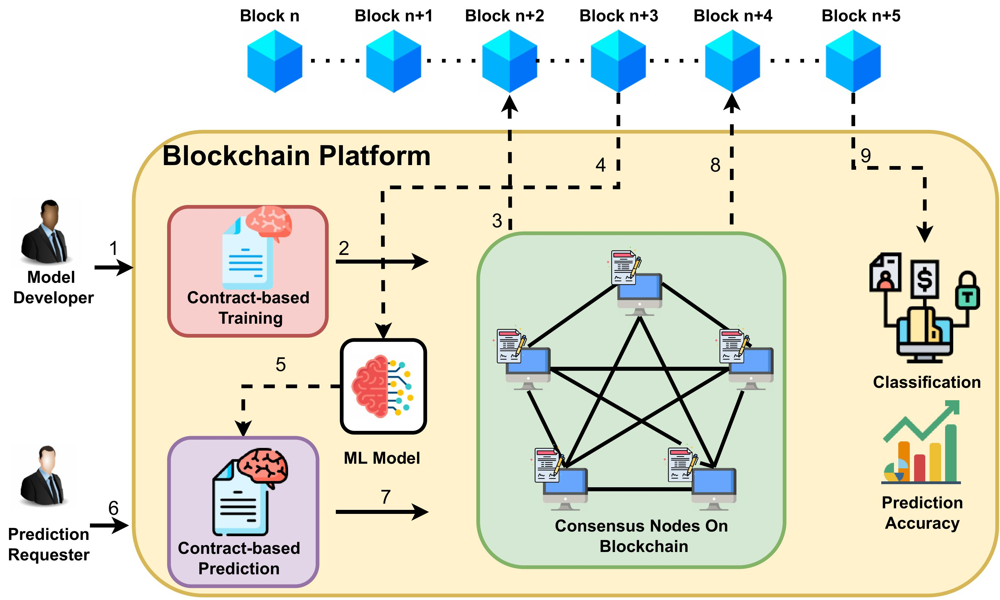

| Cognitive Smart Contracts with Naive Bayes     |                                     |
|------------------------------------------------|-------------------------------------------|
| I work on secure and trustworthy artificial intelligence (AI) algorithms. My initial research started with defending model posionign atatcks in AI algorithms. Machine learning algorithms are prone to data manipulation that breaks the integrity of predictions. Blockchain provides provenance, integrity, decentralized, consensus-based, and fault-tolerant architecture to create trusted transactions. However, smart contracts in blockchain fail to calculate fixed-point computations limiting the plausibility of predictions through cognitive algorithms in the blockchain. One of my works defend model poiosoningatatcks using blockchain. I investigate the limitations of smart contracts that restrict learning capabilities in the blockchain. |            |

I work on secure and trustworthy artificial intelligence (AI) algorithms. My initial research started with defending model posioning attacks in AI algorithms. Machine learning algorithms are prone to data manipulation that breaks the integrity of predictions. Blockchain provides provenance, integrity, decentralized, consensus-based, and fault-tolerant architecture to create trusted transactions. However, smart contracts in blockchain fail to calculate fixed-point computations limiting the plausibility of predictions through cognitive algorithms in the blockchain. One of my works defend model poiosoningatatcks using blockchain. I investigate the limitations of smart contracts that restrict learning capabilities in the blockchain. 

<table>
<tr>
  <td style="width: 50%; vertical-align: top;">
    I work on secure and trustworthy artificial intelligence (AI) algorithms. My initial research started with defending model posioning attacks in AI algorithms. Machine learning algorithms are prone to data manipulation that breaks the integrity of predictions. Blockchain provides provenance, integrity, decentralized, consensus-based, and fault-tolerant architecture to create trusted transactions. However, smart contracts in blockchain fail to calculate fixed-point computations limiting the plausibility of predictions through cognitive algorithms in the blockchain. One of my works defend model poiosoningatatcks using blockchain. I investigate the limitations of smart contracts that restrict learning capabilities in the blockchain. 
  </td>
  <td style="width: 50%; text-align: center; border: none; padding: 0;">
    
  </td>
</tr>
</table>
### Current Projects

#### Smart Contracts with Deep Learning Algorithm Intelligence to Secure Preidiction Applications
 
#### Decision Trees to Help Smart Contracts to Predict for Machine Learnign Algorithms
  Blockchain helps AI to build trustworhty and immutable predictions system. To further study the nature of smart contract problems and their limitations to predict using machine learning algorithm, we need to investigate. Decision Tree algorithm and evaluate the mathematical model for smart contracts to help the prediction algorithms. Building Decision Trees require the computation of entropy and information gain to identify the best. feature with best split to create the decision tree. We will derive the necessary equations to compute  the complex mathematical equations and implement them inside the smart contract. Moreover, the blockchain is expensive for layer one computations. The layer two scalability options are good in terms of speed but not secure enough. We will use layer one scalability options for our algorithm and record the performance evaluation. 

#### BLOCKAI Trustmeter: A Guide to Quantify The Trust of AI in Decentralized Ledger
The quest to help AI Algorithms through blockchain platform demands proofs that blockchain helps build trust in securing AI algorithms. Detering model poisoning attack is discussed in many academic articles. However, the methods that secure the models from poisoning are mostly theoretical that does not guarantee trust in the cognitive formulae. The blockchain platforms are creating footprints everywhere making data in applications tamper-proof. Some of the applications have clear benefits for using blockchain. Financial transactions are a major user of blockchain technology that protects against centralized threats. Complex applications from Artificial Intelligence are driving towards blockchain-based prediction system, but many are unware about how could blockchain help AI? This research focuses on the qunatitative analysis of security enhancement that blockchain provides to AI algorithms. This will include the security abalysis of non-blockchain versus blockchain-based prediction system   
  

<!--* Developing Scalable Consensus Protocol for AI:  To optimize the proof of stake consensus protocol by introducing faster validation methods using a lower range of block proposals, cheaper transactions, and decentralized participation of miners/validators to maintain the honesty of the systems.

* Decentralized Cross-chain Communication: To improve cross-chain communication by optimizing atomic swaps, chain relays, and hash timeclock contracts to provide trusted and secured transactions removing the third party. Additionally, design decentralized collateralization in a bi-party transaction to punish fraudulent transactions.

* Consensus for Deliberative Agreement and Group Decisions:  To develop deliberative agreement through natural language processing, dialogue response generation, machine learning, and consensus management. Investigate the requirements to support review and justice systems where group decisions are inevitable.

* Data Cooperative Security:  To develop a distributed secure architecture to protect data that shared by providers using k-anonymity, differential privacy, and homomorphic encryption for the confidentiality of data cooperatives with blockchain systems.

* IoT Network Security: Smart contracts can enhance the integrity of DDoS detections. However, blockchain consensus protocols require modification to achieve a consensus among IoT devices to detect, mitigate and recover from DDoS attacks in IoT. I plan to develop a decentralized machine learning-based consensus mechanism to detect and mitigate DDoS attacks in IoT Systems.

* Smart Legal Contracts for Metaverse: The smart legal contracts helps to remove ambiguity in a service-level agreement. However, it still requires a rigorous stress test to measure the complexity and performance by converting a large number of paper contracts. I plan to stress test the performance of conversions by recording time, cost, complexity, ambiguity level and advantage index.-->

<!--## Research Development
I am currently helping students at [Network Security Lab](https://nsl.cse.unt.edu/home) in research and investigations.  I am guiding students to pursue sound theoretical and practical research in data privacy, consensus protocols and metaverse interoprability. I plan apply for grants to finance future projects for funding students to produce impactful research. I plan to apply for grants and proposals to government and non-government institutes such as National Science Foundation (NSF), DARPA, Microsoft, and IBM. I will work specifically on the [Cybersecurity Innovation for Cyberinfrastructure (CICI)](https://beta.nsf.gov/funding/opportunities/cybersecurity-innovation-cyberinfrastructure-cici), [Secure and Trustworthy Cyberspace (SaTC)](https://beta.nsf.gov/funding/opportunities/secure-trustworthy-cyberspace-satc), and [Secure and Trustworthy Cyberspace Frontiers (SaTC Frontiers)](https://beta.nsf.gov/funding/opportunities/secure-trustworthy-cyberspace-frontiers-satc#:~:text=The%20Secure%20and%20Trustworthy%20Cyberspace,and%20social%20and%20behavioral%20sciences) programs.-->
